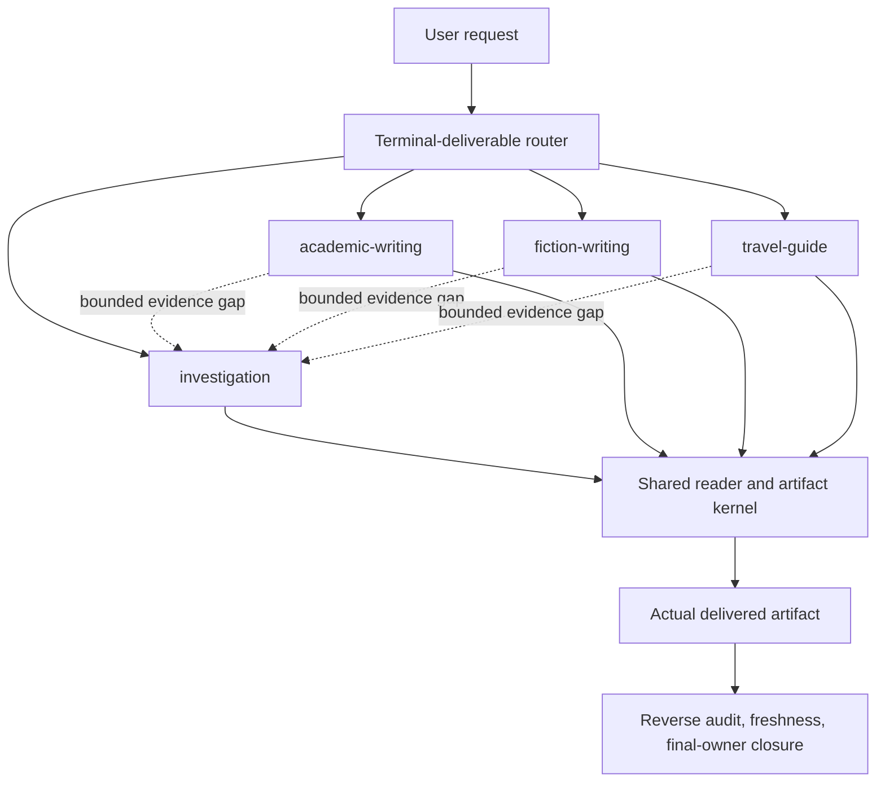

# Logic Writing

<p align="center">
  
  
  
  
</p>

<p align="center">
<!-- README HERO START -->
  
<!-- README HERO END -->
</p>

One formal Codex skill for deep investigation, academic writing, fiction, and
evidence-heavy travel guides. It keeps one public entrypoint, selects exactly
one final owner, calls specialist Guard skills for their native judgments, and
turns the result into language a real reader can follow.

> Source status: repository metadata declares `2.0.0`. Release, installation,
> and predecessor-retirement claims require their own current receipts; the
> version string alone proves none of them.

## Why one skill

These writing jobs share a real core: deciding what the final artifact is,
preserving specialist authority, tracking exact artifact identity, planning
what changes for the reader, keeping internal model language out of final
copy, and rechecking the delivered bytes. They do not share one universal data
packet. Investigation keeps evidence semantics, fiction keeps story semantics,
and travel keeps operational semantics.

Investigation and academic evidence handoffs use a current `ResearchPacket`;
the writer receives a sanitized `ReaderBrief` rather than internal ledgers.

## Four final-owner routes

| Terminal deliverable | Final owner | Preserved native strength |
| --- | --- | --- |
| Research report, briefing, evidence package, decision note, investigated answer | `investigation` | Source depth, claim competition, numbers, negative evidence, traces, bounded conclusions |
| Paper, thesis/dissertation unit, literature review, proposal, substantive academic revision | `academic-writing` | Structure, citations, revision provenance, figures/tables, document and PDF workflows |
| Story plan, short story, fiction chapter, novel, series bible, story audit or revision | `fiction-writing` | Turning points, scenes, promises, continuity, voice, world consistency, model–manuscript binding |
| Itinerary, destination guide, route plan, lodging strategy, traveler-fit recommendation | `travel-guide` | Dated evidence, weather/alerts, feasibility, fit, lodging, negative evidence, reachable fallbacks |

Routing follows the terminal deliverable, not the first activity or the subject.
A paper about tourism is academic. A researched historical novel is fiction. A
story-shaped itinerary is travel. A child investigation may return a bounded
evidence packet, but it cannot close its parent artifact.

## “Say it like a person” is an executable boundary

The shared writing kernel asks every important unit:

- What does the reader know or expect on entry?
- What concrete evidence, action, object, choice, or instruction changes that?
- What remains unresolved, or why is the unit terminal?
- Which exact later unit consumes the change?
- Who owns the technical, local, quoted, narrator, or character register?
- If a pattern repeats, what new effect makes the repetition useful?
- Which current model rows are visible in which exact delivered words?

It rejects internal workflow leakage, generic handoffs, prose that announces
its own job, flattened voices, repetition without changed effect, unbound prose,
unrealized model rows, and reviews tied to an older artifact hash. Genre profiles
then add evidence/citation fit, academic qualification, fictional payoff and
voice, or travel operability and fallback proximity.

## Specialist ownership stays intact

Logic Writing is an orchestration shell, not a replacement for its providers:

- SourceGuard owns discovery planning and evidence-depth decisions.
- LogicGuard owns source preservation, argument support, structure, citation
  semantics, model depth, and synthesis plans.
- TraceGuard owns material temporal, causal, implementation, competing-story,
  counterfactual, and prediction-boundary analysis.
- WorldGuard owns material consistency across events, agents, spaces,
  resources, capabilities, conflicts, authority, and norms.
- FlowGuard owns workflow order, state, freshness, and closure behavior.
- Documents and PDF own their native file mutation, extraction, rendering, and
  visual inspection boundaries.

A missing or non-passing provider result remains visible. Logic Writing may
explain it but cannot reimplement it locally or strengthen it into success.

## Architecture



The shared kernel is not a fifth route. No sibling final route invokes another;
travel uses neutral reader projection, not the fiction route.

See [architecture](docs/architecture.md), [responsibility map](docs/responsibility-map.md),
and [migration guide](MIGRATION.md) for the full boundaries.

## Install

Copy or install `skills/logic-writing` as the single active skill directory,
then invoke `$logic-writing`. Maintained installations should use SkillGuard's
transactional install path so the installed projection is content-exact and
recoverable.

```text
Use $logic-writing to turn this request into the correct reader-ready artifact.
```

The former public `storyline-design` and `travel-story-planner` skill ids are
not compatibility aliases. Their supported intents now route through
`$logic-writing`.

## Validation

The repository keeps separate owners for routing/shared writing, existing
routes, fiction regression, travel regression, FlowGuard models and alignment,
SkillGuard authority, reader judgment, public docs/privacy, and the final full
suite. The release gate freezes one validation inventory and accepts one current
terminal receipt per declared owner.

Focused examples:

```text
python scripts/run_fiction_regression.py --repository-root .
python scripts/run_travel_regression.py --repository-root .
python -m pytest -q
```

## Scope limits

Logic Writing does not determine factual truth, literary beauty, originality,
or traveler satisfaction. It does not cover casual copy, grammar-only edits,
quick lookups, poetry as a general-purpose route, or lightweight attraction
lists. Human judgment remains explicit where deterministic checks stop.

## License

[MIT](LICENSE)
