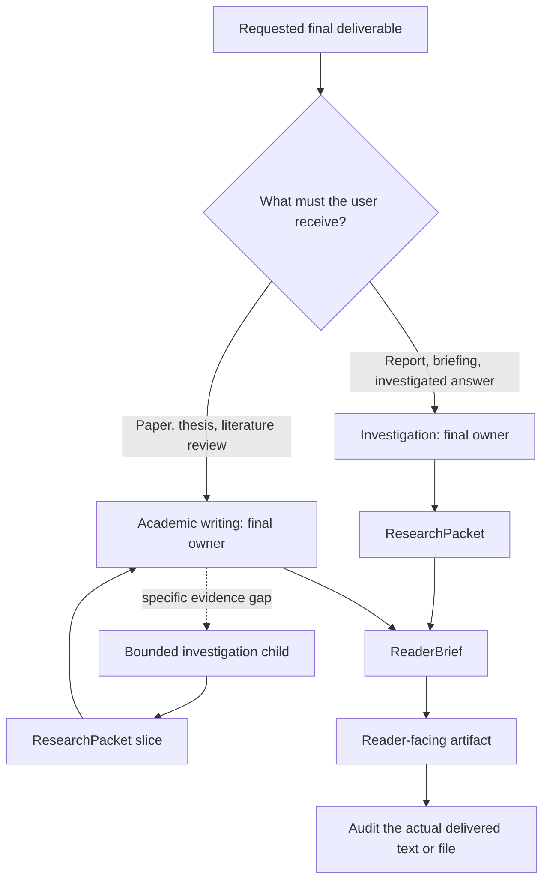

# Logic Writing

<p align="center">
  
  
  
</p>

<p align="center"><a href="README.zh-CN.md">中文说明</a></p>

<!-- README HERO START -->
<p align="center">
  
</p>

<p align="center">
  <strong>One entrypoint for deep investigation and academic writing, with evidence boundaries readers can actually follow.</strong>
</p>
<!-- README HERO END -->

Logic Writing gives related research and academic-writing work one public
entrypoint without turning that entrypoint into a replacement for specialist
skills. It selects one final owner from the deliverable the user actually
wants, coordinates the required specialists, and keeps internal workflow
language out of the finished artifact.

> **Source status:** the repository metadata declares the `1.0.0` source
> version line. That number alone does not claim a Git tag, hosted release,
> package-registry publication, completed predecessor retirement, or a full
> regression result.

## Why one entrypoint?

Investigation and academic writing share much of the same evidence work, but
they do not have the same finishing responsibility.

- A contested question may need a research report whose final owner is the
  investigation route.
- A thesis chapter may need the same research machinery, while the academic
  route must still own structure, integration, prose, and the final file.
- Both routes need a boundary between internal reasoning records and language a
  real reader can understand.

Logic Writing keeps those shared needs in one shell while preserving two
focused internal routes.

## One entrypoint, two internal routes

Route selection follows the **terminal deliverable**, not whichever activity
happens first.

| What the user expects to receive | Final owner | Bounded child work |
| --- | --- | --- |
| Research report, briefing, evidence package, decision note, or investigated answer | `investigation` | Specialist logic, trace, and document work |
| Paper, thesis chapter, dissertation section, literature review, proposal, or substantive academic revision | `academic-writing` | A bounded investigation request for a specific evidence gap |
| Quick fact, grammar-only edit, or casual copy | No Logic Writing route | Exit to a simpler workflow |

Only one route owns the final answer. An academic task may ask investigation
for a bounded evidence packet, but that child request does not take ownership
of the paper or thesis.



## The plain-language quality gate

The project uses three deliberately different artifacts so that good internal
analysis does not automatically become unreadable prose.

1. **ResearchPacket — what the evidence permits.** It records the sources that
   were actually observed, the claims and numbers they can support, competing
   explanations, unresolved gaps, and wording that would go too far. It is a
   bounded evidence handoff, not a dump of search notes.
2. **ReaderBrief — what the writer needs.** It translates that evidence into
   the reader's question, audience, genre, concepts, main findings, evidence
   anchors, alternatives, limitations, explanation order, citations, and safe
   wording. Tool names, route ids, ledgers, and agent instructions stay out.
3. **Reader audit — whether the delivered artifact works.** The current text or
   file is inspected for concept introduction, claim-to-evidence movement,
   paragraph and section handoffs, citations, limitations, genre, and reader
   fit. Metadata that says an artifact is clear is not evidence that it is.

Deterministic checks can find observable defects. A separate reader judgment is
still needed for clarity and coherence. A material edit makes the affected
audit stale.

## Specialists keep their own jobs

Logic Writing coordinates specialist skills through bounded requests and
consumes their native results. It does not recreate their judgment inside a
larger prompt.

| Specialist | What it owns | What its result does not prove by itself |
| --- | --- | --- |
| SourceGuard | Search planning and evidence-discovery depth | That a candidate or search snippet is a verified fact |
| LogicGuard | Source preservation, argument support, structure, citation semantics, model depth, and synthesis plans | Factual truth or the quality of the final prose |
| TraceGuard | Temporal order, implementation, causal chains, competing stories, counterfactuals, and prediction boundaries when material | That chronology alone establishes causality |
| FlowGuard | Process order, state, freshness, no-progress handling, and closure constraints | Source quality, argument truth, or reader clarity |
| Documents | DOCX, Word, and Google Docs mutation, tracked changes, comments, rendering, and page-level inspection | That the document's claims are well supported |
| PDF | PDF extraction, creation, rendering, and visual inspection | That extracted text proves correct layout, or that a rendered page proves semantic accuracy |

If a required specialist is unavailable, Logic Writing preserves that degraded
state. It does not silently substitute an imitation or turn “not run” into a
pass.

## Good fits and non-fits

Use Logic Writing for:

- a difficult, source-backed investigation;
- a report or briefing that must distinguish evidence from inference;
- a paper, thesis, dissertation section, literature review, or proposal;
- substantive academic revision where structure, evidence, citations, and
  prose must be integrated;
- evidence-heavy writing that currently sounds like internal AI workflow
  language instead of an explanation for people.

Use a simpler route for:

- a quick factual lookup;
- grammar-only or spelling-only editing;
- casual, low-stakes copy;
- a request whose final deliverable is still materially ambiguous.

Logic Writing does not promise that every source is accessible, that every
claim can be resolved, or that a visually correct document can be produced
without the required document provider.

## Requirements

- A Codex environment that can load the `logic-writing` skill.
- The real specialist provider required by the selected task. Specialist
  skills are installed and validated separately; this repository does not
  bundle replacements for them.
- Python 3.10 or newer for the repository's portable validation scripts.
- Documents, PDF, rendering, or office dependencies only when the requested
  artifact needs those capabilities.

## Install from a source checkout

This repository documents a direct source-copy installation path. It does not
claim a package-registry installer. Run the command from the repository root
and use a fresh target directory.

PowerShell:

```powershell
$codexHome = if ($env:CODEX_HOME) { $env:CODEX_HOME } else { Join-Path $HOME ".codex" }
$target = Join-Path $codexHome "skills\logic-writing"
if (Test-Path $target) { throw "Target already exists; review MIGRATION.md before replacing it." }
New-Item -ItemType Directory -Force (Split-Path $target) | Out-Null
Copy-Item -Recurse ".\skills\logic-writing" $target
```

POSIX shell:

```sh
target="${CODEX_HOME:-$HOME/.codex}/skills/logic-writing"
test ! -e "$target" || { echo "Target already exists; review MIGRATION.md before replacing it."; exit 1; }
mkdir -p "$(dirname "$target")"
cp -R ./skills/logic-writing "$target"
```

This copies the orchestration skill only. Install the specialist skills needed
by your task through their own supported installation paths.

## Use

Invoke the public skill and describe the final artifact, reader, scope, and
important constraints. The internal route is selected for you.

```text
$logic-writing

Investigate this contested question and produce a concise decision briefing.
Separate observed facts, competing explanations, and unresolved evidence gaps.
```

```text
$logic-writing

Revise this literature-review chapter for a disciplinary audience. Preserve
the supplied material, repair the argument progression, and return a coherent
academic chapter with claim-level citations.
```

Useful request details include:

- the final deliverable and intended reader;
- geographic, temporal, and disciplinary scope;
- source or citation requirements;
- material that must be preserved in a revision;
- required file format, tracked changes, comments, or visual inspection;
- what uncertainty would change the conclusion.

## Evidence and claim boundaries

- Search candidates and snippets are leads, not facts.
- Several pages that repeat one origin do not become independent evidence.
- An announcement can show stated intent; it does not by itself prove
  implementation or effect.
- Earlier-than does not mean caused-by.
- Text extraction does not prove layout correctness.
- A green development check does not prove a user's artifact is clear, and a
  clear artifact does not prove the repository is release-ready.
- Final wording cannot be stronger than the weakest unresolved important
  obligation.

## Repository map

```text
skills/logic-writing/   Installable skill, route references, schemas, and helpers
scripts/                Portable repository validation entrypoints
tests/                  Contract and regression tests
docs/                   Public architecture, responsibility, and retirement guides
MIGRATION.md            Cutover guidance from the former public entrypoints
CONTRIBUTING.md         Contribution and validation expectations
```

The public repository is intended to contain reusable source, schemas, tests,
and documentation. It should not contain user artifacts, private source
material, credentials, machine-specific configuration, or runtime recovery
material.

## Local validation entrypoints

These commands are available to contributors; listing them here is not a claim
that a particular checkout has passed them.

```sh
python scripts/validate_skill.py --skill-root skills/logic-writing --json
python scripts/check_privacy.py --root . --json
python -m pytest -q
```

See [CONTRIBUTING.md](CONTRIBUTING.md) for scope and evidence rules,
[docs/architecture.md](docs/architecture.md) for the design, and
[docs/responsibility-map.md](docs/responsibility-map.md) for exact ownership.

## Migration and retirement

Logic Writing starts a clean `1.0.0` source version line and replaces the two
former public entrypoints with one supported entrypoint and two internal
routes. It does not provide compatibility aliases or treat predecessor runtime
records as current evidence. See [MIGRATION.md](MIGRATION.md) and the
[release and retirement checklist](docs/release-retirement-checklist.md).

## License

MIT. See [LICENSE](LICENSE).
