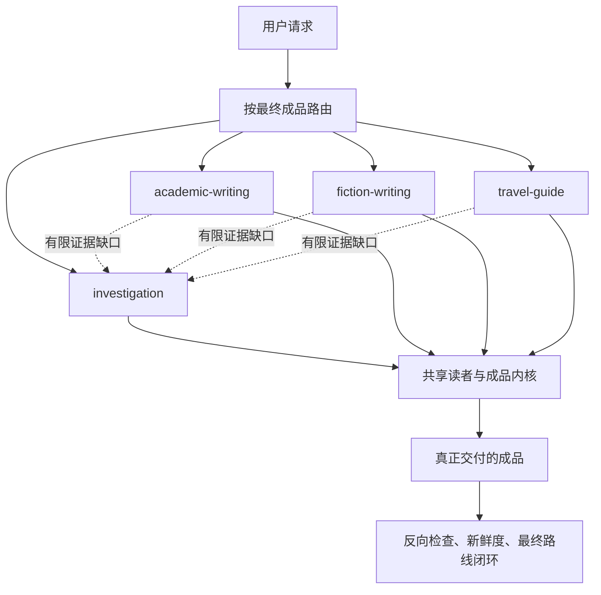

# Logic Writing

<p align="center">
  
  
  
  
</p>

<p align="center">
<!-- README HERO START -->
  
<!-- README HERO END -->
</p>

一个正式的 Codex 写作技能，统一处理深度调查、学术写作、小说和重证据的
旅行攻略。它只有一个公开入口，每次只选一个最终负责人；需要专业判断时，
仍由相应 Guard 技能负责，最后再把内部模型翻译成人能读懂的话。

> 源码状态：仓库元数据声明 `2.0.0`。这个版本号本身不代表 GitHub Release、
> 安装、完整回归或旧仓库退役已经完成；这些结论都要有各自当前的验证记录。

## 为什么合在一起

这四类工作确实共享一层能力：判断最后要交付什么、维护唯一负责人、保留
专业技能的判断权、记住成品的真实版本、规划每一部分让读者新明白了什么、
不把内部术语漏进正文，并在最后检查真正交付的文件。

但它们并不共用一个万能大表。调查保留证据语义，小说保留故事语义，旅行
保留时间、可行性和执行语义。合并的是外壳和真正通用的内核，不是把所有
领域压成同一种写法。

调查和学术之间用当前的 `ResearchPacket` 交接证据；写作者收到的是去掉内部
台账语言的 `ReaderBrief`。

## 一个入口，四条最终路线

| 最后要交付的东西 | 最终负责人 | 保留下来的强项 |
| --- | --- | --- |
| 调查报告、简报、证据包、决策说明、调查型回答 | `investigation` | 资料深度、观点竞争、关键数字、反面证据、时间/因果链、有边界的结论 |
| 论文、学位论文章节、文献综述、研究计划、实质性学术修订 | `academic-writing` | 结构、引文、修订溯源、图表、Word/PDF 工作流 |
| 故事计划、短篇、小说章节、长篇、系列设定、故事审计或修订 | `fiction-writing` | 转折、场景、承诺兑现、连续性、声音、世界一致性、模型—正文绑定 |
| 行程、目的地攻略、路线方案、住宿策略、旅行者适配建议 | `travel-guide` | 有日期的证据、天气/警报、可行性、体力与偏好、住宿、负面证据、可达备选 |

路由看的是“最后交什么”，不是第一步做什么，也不是题材是什么。旅游研究
论文仍是学术；查了历史资料的小说仍是小说；写得像旅程故事的行程仍是旅行。
学术、小说和旅行可以让调查路线补一个明确的证据缺口，但调查不能替父路线
宣布最终完成。

## “说人话”不是一句口号

共享写作内核要求每个重要单元回答：

- 读者进来时已经知道或以为什么？
- 哪个具体证据、行动、物件、选择或指令改变了这种认识？
- 还有什么没有解决，或者为什么这里已经可以结束？
- 后面哪一个明确单元会用到这个变化？
- 技术词、地方说法、引语、叙述者或人物语言到底属于谁？
- 如果结构重复了，它产生了什么新的升级、对比、代价或解释？
- 当前模型中的哪一行，真正落在成品的哪一段话里？

它会拦住这些常见问题：内部流程词泄漏、只说“为下文铺垫”的空衔接、
正文解释自己打算做什么、所有人物和资料都说同一种抽象话、没有新效果的
重复、没有模型依据的正文、没有写进成品的模型行，以及仍绑定旧稿的审查。

然后每条路线再加自己的标准：调查和学术看证据与引用，小说看戏剧化、声音
和兑现，旅行看日期、能不能走、适不适合这个人、备选是否真的就在附近。

## 专业技能仍然各管各的

- SourceGuard 决定下一步搜什么、资料深度够不够。
- LogicGuard 负责资料保存、论证支持、结构、引文语义、模型深化和综合计划。
- TraceGuard 负责重要的时间、执行、因果、竞争叙事、反事实和预测边界。
- WorldGuard 负责事件、人物、空间、资源、能力、冲突、权力和规范能否一致。
- FlowGuard 负责流程顺序、状态、新鲜度和闭环行为。
- Documents 与 PDF 负责各自真实文件的修改、提取、渲染和视觉检查。

Logic Writing 可以组织和解释这些结果，但不能自己假装跑过专业检查，也不能
把缺失、部分通过或过期的结果改写成成功。

## 整体结构



共享内核不是第五条路线。兄弟路线不能互相当最终负责人；旅行使用中性的
读者投影，不会暗中调用小说路线。

更多边界见[架构说明](docs/architecture.md)、[责任地图](docs/responsibility-map.md)
和[迁移说明](MIGRATION.md)。

## 安装和使用

只安装 `skills/logic-writing` 这一个活动技能目录，然后调用：

```text
使用 $logic-writing，把这个请求路由到正确的最终负责人，并交付人能读懂的成品。
```

维护中的安装应走 SkillGuard 的事务式安装流程，保证安装内容与源码完全一致，
并保留回滚能力。旧的 `storyline-design` 和 `travel-story-planner` 不提供兼容别名；
它们支持的需求现在统一从 `$logic-writing` 进入。

## 验证边界

路由与共享写作、原有两条路线、小说、旅行、FlowGuard 模型、SkillGuard 权威、
读者判断、公开文档与隐私、最终全量测试都有各自明确的验证负责人。发布前会
冻结一次完整清单，每个负责人只能交一份当前且终态成功的记录。

## 不负责什么

Logic Writing 不能自动判定事实真伪、文学美感、原创性或旅行满意度。它也不是
日常文案、纯语法修改、快速查事实、通用诗歌或简单景点清单的万能入口。机器
检查到不了的地方，必须明确保留人工判断。

## 许可证

[MIT](LICENSE)
