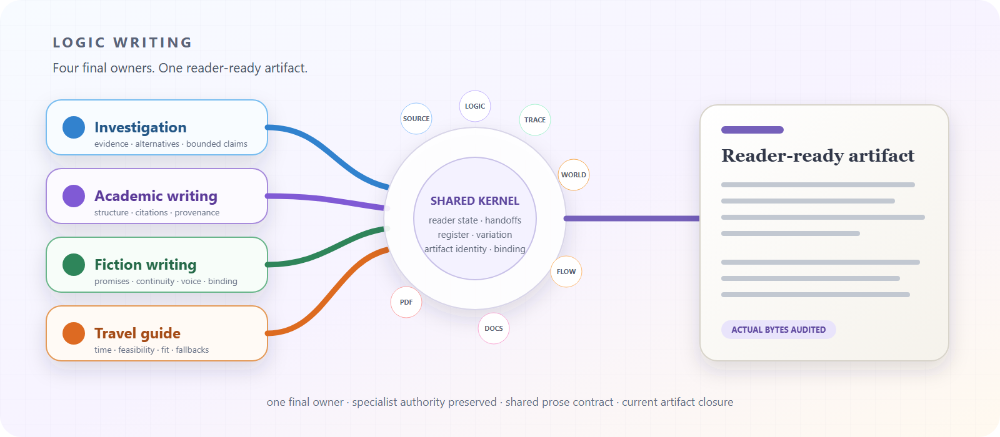
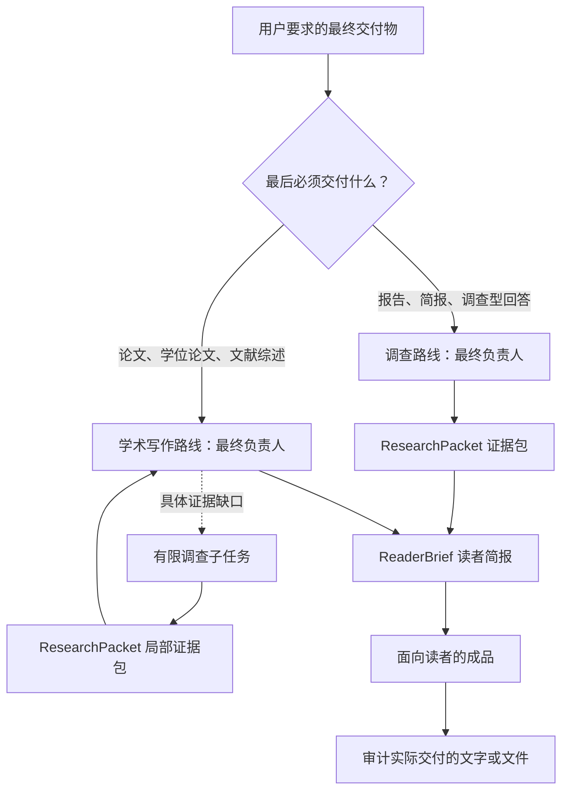

# Logic Writing

<p align="center">
  
  
  
</p>

<p align="center"><a href="README.md">English</a></p>

<!-- README HERO START -->
<p align="center">
  
</p>

<p align="center">
  <strong>一个入口连接深度调查与学术写作，让读者既看懂结论，也看清证据边界。</strong>
</p>
<!-- README HERO END -->

Logic Writing 为相互关联的调查和学术写作提供一个公开入口，但不会把这个入口变成取代所有专业技能的“万能技能”。它根据用户最终要拿到的东西选择唯一负责人，协调所需的专业技能，并阻止内部工作流语言混入最终成品。

> **源码状态：**仓库元数据声明了 `1.0.2` 这条源码版本线。这个数字本身不代表已经存在 Git 标签、GitHub Release、包管理器发布、旧仓库退役完成或完整回归通过。

## 为什么要统一入口？

调查和学术写作会共用大量证据工作，但最后负责把事情做完的人并不相同。

- 一个有争议的问题，最终可能需要的是调查路线负责的研究报告。
- 一个论文章节也可能需要相同的调查能力，但结构整合、正文写作和最终文件仍必须由学术写作路线负责。
- 两条路线都需要一道边界，把内部推理记录和普通读者能理解的语言分开。

Logic Writing 把共同部分放进一个上层壳中，同时保留两条职责清楚的内部路线。

## 一个入口，两条内部路线

路线由**最终交付物**决定，而不是由最先发生的动作决定。

| 用户最后希望收到什么 | 最终负责人 | 可以委托的有限子任务 |
| --- | --- | --- |
| 研究报告、简报、证据包、决策说明或调查型回答 | `investigation` | 有边界的论证、时间链与文档处理工作 |
| 论文、论文章节、学位论文章节、文献综述、研究计划或实质性学术修订 | `academic-writing` | 针对某个证据缺口的有限调查请求 |
| 快速事实查询、纯语法修改或随手文案 | 不进入 Logic Writing | 转给更简单的工作流 |

最终只能有一个负责人。学术任务可以让调查路线补一个有明确边界的证据包，但这个子任务不会接管论文或学位论文。



## “说人话”的三道质量闸门

项目故意把三个产物分开，避免不错的内部分析直接变成难读的正文。

1. **ResearchPacket——证据允许说到哪里。**它记录真正看过的来源、能够支持的主张和数字、竞争解释、尚未解决的缺口，以及哪些说法会超出证据。它是有边界的证据交接包，不是搜索笔记大杂烩。
2. **ReaderBrief——写作者需要知道什么。**它把证据翻译成读者问题、受众、体裁、必要概念、主要发现、证据锚点、替代解释、限制、讲解顺序、引用和安全措辞。工具名、路线编号、内部台账和智能体指令不会进入其中。
3. **读者审计——实际成品能不能读懂。**审计对象是当前文字或文件本身，检查概念是否先解释、论点与证据是否接得上、段落与章节如何衔接、引用和限制是否放对位置，以及成品是否符合体裁和读者。元数据写着“清楚”不能证明正文真的清楚。

确定性检查可以找到能直接观察到的缺陷，但清晰度和连贯性仍需要单独的读者判断。只要正文发生实质性修改，受影响的审计结果就会过期。

## 专业技能继续做自己的专业工作

Logic Writing 通过有边界的请求协调各个专业技能，并读取它们自己的结果；它不会在一个更大的提示词里重新模仿这些专业判断。

| 专业技能 | 它负责什么 | 单独拿到它的结果还不能证明什么 |
| --- | --- | --- |
| SourceGuard | 搜索行动规划和证据发现深度 | 搜索候选或摘要已经是核实过的事实 |
| LogicGuard | 保存来源、论证支撑、结构、引用语义、模型深度与综合计划 | 事实一定为真，或最终正文一定好读 |
| TraceGuard | 在确有需要时处理时间顺序、执行链、因果链、竞争叙事、反事实和预测边界 | 先发生就一定导致后发生 |
| FlowGuard | 流程顺序、状态、证据新鲜度、无进展处理与收口约束 | 来源质量、论证真假或读者清晰度 |
| Documents | DOCX、Word 和 Google Docs 修改、修订痕迹、批注、渲染与逐页检查 | 文档里的主张有充分证据 |
| PDF | PDF 提取、创建、渲染和视觉检查 | 提取到文字就代表版式正确，或页面能显示就代表语义正确 |

如果必需的专业能力不可用，Logic Writing 会如实保留这个降级状态。它不会暗中换成本地仿制品，也不会把“没有运行”写成“已经通过”。

## 适合什么，不适合什么

适合使用 Logic Writing 的情况：

- 困难且必须有来源支撑的调查；
- 必须把证据和推断分开的报告或简报；
- 论文、学位论文、论文章节、文献综述或研究计划；
- 需要同时整合结构、证据、引用和语言的实质性学术修订；
- 证据很多，但当前文本像 AI 在汇报内部流程，而不像人在解释问题。

以下情况应使用更简单的路线：

- 快速查一个事实；
- 只改拼写或语法；
- 低风险的随手文案；
- 最终交付物仍然存在实质性歧义。

Logic Writing 不保证每个来源都能访问，不保证每个问题都有确定答案，也不保证在缺少相应文档工具时仍能交付版式正确的文件。

## 使用条件

- 能够加载 `logic-writing` 技能的 Codex 环境。
- 当前任务所需的真实专业技能。专业技能分别安装、分别验证；本仓库不内置它们的替代品。
- 运行仓库便携验证脚本时需要 Python 3.10 或更新版本。
- 只有在交付物确实需要时，才需要 Documents、PDF、渲染或办公软件相关依赖。

## 从源码副本安装

本仓库说明的是直接复制源码的安装方式，并不声称已经提供包管理器安装。请在仓库根目录运行命令，并使用一个尚不存在的目标目录。

PowerShell：

```powershell
$codexHome = if ($env:CODEX_HOME) { $env:CODEX_HOME } else { Join-Path $HOME ".codex" }
$target = Join-Path $codexHome "skills\logic-writing"
if (Test-Path $target) { throw "Target already exists; review MIGRATION.md before replacing it." }
New-Item -ItemType Directory -Force (Split-Path $target) | Out-Null
Copy-Item -Recurse ".\skills\logic-writing" $target
```

POSIX shell：

```sh
target="${CODEX_HOME:-$HOME/.codex}/skills/logic-writing"
test ! -e "$target" || { echo "Target already exists; review MIGRATION.md before replacing it."; exit 1; }
mkdir -p "$(dirname "$target")"
cp -R ./skills/logic-writing "$target"
```

这一步只会复制上层编排技能。任务需要的各个专业技能仍应通过它们各自支持的方式安装。

## 使用方法

调用公开技能，并说明最终交付物、读者、范围和重要限制。内部路线会自动选择。

```text
$logic-writing

调查这个有争议的问题，并写一份简洁的决策简报。请区分观察到的事实、竞争解释和尚未解决的证据缺口。
```

```text
$logic-writing

面向本学科读者修订这一章文献综述。保留原有材料，修复论证推进关系，并交付一章连贯、带有论点级引用的学术正文。
```

最好在请求中说明：

- 最终交付物和目标读者；
- 地理、时间与学科范围；
- 来源或引用要求；
- 修订时必须保留的材料；
- 文件格式、修订痕迹、批注或视觉检查要求；
- 哪些不确定性会改变结论。

## 证据与措辞边界

- 搜索候选和摘要只是线索，不是事实。
- 多个页面重复同一个原始来源，不会自动变成独立证据。
- 公告可以证明“曾经宣布”，但不能单独证明“已经执行”或“已经产生效果”。
- 先发生不等于造成后发生。
- 提取到文字不能证明版式正确。
- 开发检查通过不能证明用户成品清楚；用户成品清楚也不能证明仓库已经可以发布。
- 最终措辞不能强于最薄弱、且尚未解决的重要义务。

## 仓库结构

```text
skills/logic-writing/   可安装技能、路线说明、数据结构和辅助脚本
scripts/                便携的仓库级验证入口
tests/                  合同与回归测试
docs/                   公开架构、职责和退役指南
MIGRATION.md            从旧公开入口切换的说明
CONTRIBUTING.md         贡献范围与验证要求
```

公开仓库只应包含可复用源码、数据结构、测试和文档，不应包含用户成品、私有来源材料、凭据、机器专属配置或运行时恢复材料。

## 本地验证入口

贡献者可以运行以下命令；在这里列出命令，并不代表某个具体源码副本已经通过它们。

```sh
python scripts/validate_skill.py --skill-root skills/logic-writing --json
python scripts/check_privacy.py --root . --json
python -m pytest -q
```

贡献范围和证据要求见 [CONTRIBUTING.md](CONTRIBUTING.md)，设计说明见 [docs/architecture.md](docs/architecture.md)，具体职责划分见 [docs/responsibility-map.md](docs/responsibility-map.md)。

## 迁移与退役

Logic Writing 从独立的 `1.0.0` 源码版本线开始，用“一个公开入口、两条内部路线”替代原来的两个公开入口。它不提供兼容别名，也不会把旧技能留下的运行记录当作当前证据。详情见 [MIGRATION.md](MIGRATION.md) 和[发布与退役检查清单](docs/release-retirement-checklist.md)。

## 许可证

MIT，见 [LICENSE](LICENSE)。
