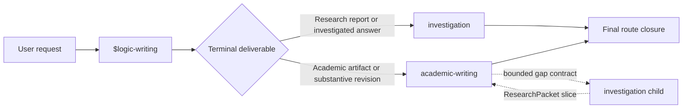
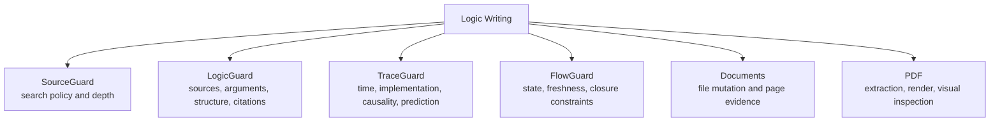

# Logic Writing Architecture

## Purpose

Logic Writing is a thin orchestration skill for two closely related outcomes:
source-backed investigation and substantive academic writing. “Thin” means it
owns routing, bounded handoffs, reader translation, and final evidence
aggregation while leaving specialist decisions with the specialist that can
actually justify them.

The architecture addresses two recurring failures:

1. investigation and academic writing duplicate the same evidence machinery
   but disagree about who owns the final artifact; and
2. internal reasoning records leak into prose, producing text that sounds like
   an AI describing its workflow rather than a person explaining the subject.

## Control shape: one public entrypoint, one final owner



Route selection asks what the user must receive at the end. It does not run
both routes as peers and choose a winner later. If the final genre is materially
ambiguous, routing stops for one focused clarification.

The investigation route owns research reports, briefings, evidence packages,
decision notes, and investigated answers. The academic-writing route owns
papers, thesis and dissertation units, literature reviews, proposals, and
substantive revisions. A child investigation may close only its exact gap; it
cannot close the parent academic artifact.

## Specialist adapter layer

Logic Writing sends a bounded request to the real provider, checks the returned
scope and identity, and preserves the provider's native status. The adapter is
an envelope, not a second implementation of the specialist.



Before a required adapter call, provider availability must be checked. Missing
or inaccessible providers remain typed degraded states. The shell must not
substitute a local imitation, reinterpret a native result, or strengthen a
bounded result into a pass.

## Evidence path

The main dependency chain is:

```text
observed source
  -> claim support
  -> ResearchPacket
  -> ReaderBrief
  -> reader-facing artifact
  -> actual-artifact audit
  -> final closure
```

Each downstream step depends on the exact current identity of the relevant
upstream material. A material change makes affected downstream evidence stale.
Logs and progress messages are not source evidence.

### ResearchPacket

`ResearchPacket` is the default cross-route evidence handoff. It binds observed
sources and their lineages to claims, important numbers, counterevidence,
alternatives, unresolved gaps, allowed wording, prohibited overclaims, and the
native evidence that supports those boundaries.

It excludes search candidates treated as facts, unresolved citation anchors,
and caller-authored completion labels. A bounded child request returns only the
requested packet slice.

### ReaderBrief

`ReaderBrief` is the clean-room writing contract. It keeps what a writer needs:
the reader's question, audience, genre, concepts, findings, evidence anchors,
alternatives, limitations, sequence, citations, and safe wording.

It excludes Guard names, route and model ids, raw ledgers, status-field names,
tool instructions, and agent work plans. Provider failures are translated into
the factual limitation the reader needs, while the raw operational state stays
in internal evidence.

### Actual-artifact audit

The audit reads the current delivered text or file. It rebuilds the structure
and checks whether concepts are introduced before use, references are clear,
claims move through reasons and evidence, paragraphs and sections hand off
coherently, citations attach to the supported claim, material limitations are
placed where they matter, and the artifact fits its genre and reader.

Deterministic diagnostics and reader-quality judgment are separate evidence
classes. Neither metadata nor a story plan can stand in for inspecting the
actual artifact.

## Investigation route

The investigation route:

1. defines the reader question, critical claims, scope, source roles, and an
   evidence-based stopping rule;
2. uses SourceGuard to choose discovery actions and LogicGuard to preserve
   observed sources;
3. uses LogicGuard for warrants, alternatives, rebuttals, and scope, and calls
   TraceGuard only when a material conclusion depends on a trace;
4. distinguishes chronology, mechanism, implementation, exposure, outcome,
   competing explanations, and forecast evidence where relevant;
5. assembles a current ResearchPacket; and
6. writes and audits the requested report or bounded handoff.

More links do not automatically mean more depth. Repeated lineage counts as
repeated lineage, and inaccessible material remains an access gap.

## Academic-writing route

The academic-writing route:

1. defines the artifact, audience, contribution, revision constraints,
   citation style, format, and final deliverable;
2. maps real sections, paragraphs, figures, tables, notes, and appendices before
   broad revision;
3. checks how important units contribute and what later unit consumes them;
4. deepens shallow literature, method, argument, figure, and table units;
5. requests a bounded investigation packet when evidence is missing;
6. integrates evidence into academic prose and delegates real file mutation or
   visual inspection to Documents or PDF; and
7. audits the final current artifact and reconciles revision provenance.

The default for supplied material is preservation until omission, movement, or
rewriting is explicitly accounted for.

## Operational evidence and development evidence

Two planes must remain separate:

| Plane | Question it answers | It does not answer |
| --- | --- | --- |
| User operation | Is this request correctly routed, supported, written, rendered when needed, and audited now? | Is the repository ready to publish? |
| Repository development | Are current source, contracts, models, tests, packaging, and retirement steps validated for this snapshot? | Is a particular user's prose clear or factually supported? |

An edit to a user artifact stales the dependent user-artifact audits. It does
not automatically stale repository release evidence. A successful repository
check likewise does not validate unseen reader-facing prose.

## Closure rules

- Only the selected final route may close the requested artifact.
- Final wording is no stronger than the weakest unresolved important
  obligation.
- `not_run`, `stale`, `provider_unavailable`, `dependency_unavailable`,
  `access_gap`, `render_not_run`, `bounded`, `partial`, `blocked`, and `failed`
  remain non-pass states.
- A non-pass result identifies the affected claim or unit, safe wording,
  prohibited wording, next owner, and required repair.
- Two identical failed repairs without new evidence terminate visibly instead
  of looping.

## Public boundary

The public architecture includes reusable skill source, schemas, neutral tests,
and documentation. User artifacts, private source libraries, credentials,
machine-specific provider paths, and recovery archives are outside the public
repository boundary.

This document describes the intended source architecture. It does not assert
that a hosted release exists or that every regression and external provider has
been validated in a particular checkout.
