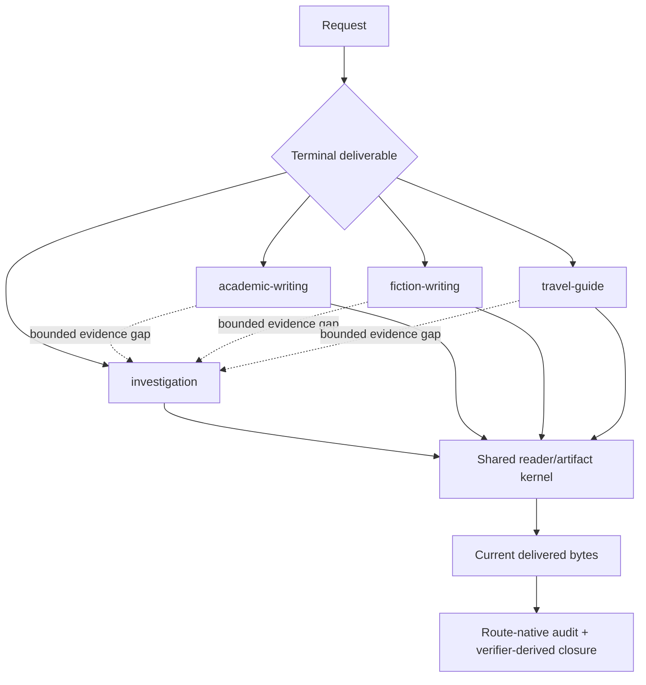

# Architecture

Logic Writing is a thin public shell around four route-native owners and a
small neutral writing kernel. “Thin” means routing, handoff, artifact identity,
reader projection, freshness, and closure are shared; domain judgment stays
with the route or specialist that owns it.

## Four final-owner routes

Exactly one route owns every substantive terminal artifact:

| Route | Owns | May request |
| --- | --- | --- |
| `investigation` | Reports, briefings, evidence packages, decision notes, investigated answers | Specialist source, logic, trace, world, document, and PDF work |
| `academic-writing` | Papers, thesis/dissertation units, literature reviews, proposals, substantive revisions | A bounded investigation packet plus specialist work |
| `fiction-writing` | Story plans, short stories, chapters, novels, series structures, story audits and revisions | Bounded factual/canon research plus specialist work |
| `travel-guide` | Deep itineraries, destination guides, routes, lodging strategies, traveler-fit recommendations | Bounded investigation plus specialist work |

The router uses terminal deliverable, not topic or presentation style. Shared
projection never becomes a fifth owner. A sibling route cannot invoke another
sibling route as its final owner.

## Neutral shared kernel

The shared layer owns only behavior that means the same thing in every genre:

- one route-decision identity;
- audience, purpose, incoming reader state, and artifact form;
- unit contribution and concrete incoming/outgoing reader-state interfaces;
- specific downstream consumer or terminal disposition;
- register ownership and effect-aware variation;
- model-row to exact artifact-span binding;
- internal-language and explanation-pressure review;
- actual-artifact identity, receipt authority, freshness, and closure
  composition.

It deliberately does not define a universal packet. Investigation retains
ResearchPacket and claim/source semantics. Fiction retains story models,
promises, continuity, voice, and semantic review. Travel retains trip context,
source-time modes, feasibility, fit, fallback, and reverse-guide semantics.

## Route-native layers

### Investigation

Investigation moves from question and claim contract to source portfolio,
belief updates, competing conclusions, key-number discipline, ResearchPacket,
reader prose, actual-artifact audit, and bounded closure. Source candidates and
snippets never become observed evidence by wording alone.

### Academic writing

Academic writing inventories the real source artifact, models chapters,
sections, paragraphs, figures and tables, deepens important shallow units,
requests bounded evidence gaps, integrates citations, preserves revision
provenance, uses Documents/PDF for real files, and audits the final artifact.

### Fiction writing

Fiction selects compact, short-story, long-form, or final-manuscript depth.
It preserves contribution, turning points, scenes, promises, arcs, chapter
interfaces, continuity, voice/style, Guard handoffs, project model mesh,
real-manuscript identity, structured semantic review, and model-prose binding.
WorldGuard owns material world consistency even when the setting is fictional.

### Travel guide

Travel starts from the traveler profile and time boundary; builds a role-based
source portfolio; checks candidates and routes with WorldGuard and TraceGuard;
validates transport, access, weather, cost, pace, stamina, companions, lodging,
fit, safety and accessibility; preserves negative evidence and reachable
fallbacks; then projects checked route cards through the shared reader kernel.
It never calls the fiction route.

## Specialist boundary

SourceGuard, LogicGuard, TraceGuard, WorldGuard, FlowGuard, Documents, and PDF
remain native owners. Logic Writing validates bounded request/result envelopes
and consumes their current receipts. Provider absence, access gaps, partial
results, stale identities, failed rendering, or human-review boundaries remain
typed non-pass states.

## FlowGuard mesh

The parent lifecycle keeps the operation plane separate from the development
plane. Its operation children are routing/Guard authority, research packet,
shared reader artifact, fiction, travel, and freshness/closure. The development
child owns frozen validation, staged installation, global route projection,
GitHub release, local predecessor quarantine, Travel-first privatization,
replacement health recheck, Storyline privatization, and the user's later
deletion handoff.

Shared kernel state is limited to route decision, artifact identity, reader
projection identity, receipt authority, and freshness. Fiction and travel own
disjoint domain state and side effects.

## Validation ownership

OpenSpec records product obligations and acceptance checks. FlowGuard models
state, ordering, ownership, known-bad behavior, and dependency-sensitive
closure. SkillGuard compiles the target skill's exact declared-check inventory
and installation projection. TestMesh freezes one final owner plan; receipt
consumers never rerun the owner command.

Final release validation runs only after source, toolchain, and inventory
identities are frozen. Runtime outputs and progress logs are evidence, not
source authority.
