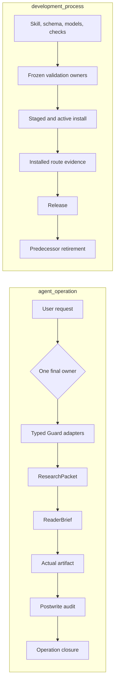

## Context

The predecessor repositories solve adjacent parts of one journey but expose two competing entrypoints, duplicate lifecycle checks, and carry stale maintenance records. Their strongest material is complementary: the investigation workflow has a disciplined source/trace/argument loop, while the academic workflow understands document hierarchy, revision provenance, literature progression, method depth, citations, figures, tables, and actual artifact delivery. Their common weakness is the boundary between internal reasoning and the text a person reads: internal labels leak into prose, route handoffs are implicit, and completion can be asserted from caller-authored status fields instead of current source and artifact evidence.

Logic Writing is therefore a greenfield orchestration repository. It reuses the existing specialist skills as external authorities and owns only route selection, bounded handoffs, reader-brief compilation, reader-facing writing, and final claim projection. The repository starts a clean `v1.0.0` line; predecessor histories and private work remain in verified offline backups, not in the public Git history.

Current environmental constraints matter to the design. SourceGuard and TraceGuard can be imported on the development machine, but their observed import roots are not stable installation locations. Documents and PDF capabilities may be unavailable or partially available on a given machine. Every adapter must therefore preflight the current provider and return a typed visible failure rather than hard-code a local path or improvise a replacement engine.

## Goals / Non-Goals

**Goals:**

- Provide one discoverable skill, `logic-writing`, with two internal routes and exactly one final owner per task.
- Preserve the strongest investigation and academic-writing behavior while removing duplicated orchestration, obsolete maintenance shells, copied scripts, and keyword-only quality gates.
- Keep SourceGuard, LogicGuard, TraceGuard, FlowGuard, Documents, and PDF authoritative for their own domains.
- Make investigation-to-writing handoff explicit, typed, content-addressed, and freshness-aware.
- Make final prose sound like a competent human writer addressing a declared reader, not like an AI narrating its own workflow.
- Derive closure from actual current sources, models, packets, text, and document renders.
- Support atomic installation, installed-route verification, a clean public release, and recoverable retirement of both predecessor skills and repositories.

**Non-Goals:**

- Reimplement SourceGuard search planning, LogicGuard argument evaluation, TraceGuard temporal/causal inference, FlowGuard lifecycle modeling, DOCX editing, or PDF rendering.
- Provide aliases, forwarding stubs, dual readers, migration commands, or runtime fallbacks for predecessor skill ids.
- Promise factual truth, universal completeness, or visual QA when a required provider did not run.
- Turn every small lookup, grammar correction, or formatting task into a heavy workflow.
- Import private investigations, case libraries, caches, old runtime receipts, or machine-specific paths into the public repository.

## Decisions

### 1. One public entrypoint, two internal routes

The installed folder is `logic-writing`. The route selector chooses `investigation` or `academic-writing` from the terminal deliverable, not from the first action. A general report remains investigation-owned even though it needs polished prose. A paper or thesis remains academic-owned even if research must happen first. In the latter case investigation is a bounded child route and cannot issue the academic final closure.

Alternative considered: keep two public skills behind a common README. Rejected because activation remains ambiguous, handoff remains optional, and two skills can still claim final ownership.

Alternative considered: one giant undifferentiated workflow. Rejected because it would load irrelevant instructions, blur stop conditions, and make it hard to tell which route owns the final artifact.

### 2. Thin, typed specialist adapters

All specialist calls use a common envelope while preserving the native receipt type:

```text
AdapterRequest
  task_id, parent_route, requested_scope, input_artifact_refs,
  input_fingerprints, claim_scope, required_output_type,
  freshness_baseline, user_constraints

AdapterResult
  status, artifact_refs, native_receipt_refs, covered_scope,
  unresolved_gaps, stale_inputs, safe_claim,
  unsafe_claim_boundary, next_route
```

Accepted result states include `passed`, `partial`, `bounded`, `downgraded`, `blocked`, `not_run`, `stale`, `provider_unavailable`, `access_gap`, `render_not_run`, and `saved_but_modeling_incomplete`. Non-pass states may only narrow downstream wording. Adapters never convert a candidate source into a fact, an outline into final prose, a process receipt into content evidence, or text extraction into layout proof.

Provider ownership is fixed:

- SourceGuard: search planning, source candidates, provenance, independence, gap and portfolio depth.
- LogicGuard source library: preserve, deduplicate, read/model, deepen, and reuse concrete sources.
- LogicGuard model deepening: grow important shallow model units.
- LogicGuard structured artifact: structure and contribution audit.
- LogicGuard artifact synthesis: story plan, outline, section and paragraph blueprint.
- LogicGuard main route: mixed argument modeling, conclusion competition, citation semantics, and postwrite logic audit.
- TraceGuard: temporal, implementation, causal, counterfactual, and competing-storyline analysis.
- FlowGuard: task/process states, ownership, freshness, revalidation, install/release lifecycle, and closure boundaries.
- Documents: DOCX/Word mutation, OOXML features, render and page QA.
- PDF: PDF extraction, rendering, creation, and visual QA.

Alternative considered: copy the strongest rules and scripts into Logic Writing. Rejected because duplicated algorithms drift, create a second authority, and cannot produce valid native receipts.

### 3. Separate operation and development planes

FlowGuard models two typed planes that share no implicit staleness edges.



Changing a user artifact stales its postwrite and operation closure evidence, but not the installed skill or GitHub release. Changing a skill, schema, model, adapter contract, or checker stales only the development owners that explicitly consume that component and their dependent installation/release projections.

### 4. ResearchPacket is the only cross-route evidence handoff

`ResearchPacket` contains the question and scope, source registry with locators and source roles, claim and key-number ledger, support and limiting evidence, lineage and independence status, live alternatives and confounders, trace outputs when applicable, safe and unsafe wording, unresolved gaps, native receipt references, input manifests, and a packet fingerprint.

The packet is not a compatibility format for old workflow records. It is the one current new contract. A packet assembler derives status from its actual members and receipts; caller-authored `complete` or `passed` fields have no authority. The academic route validates the packet fingerprint and keeps final ownership.

### 5. ReaderBrief creates a two-room writing boundary

The internal room may contain Guard names, route ids, model cards, gap ledgers, receipts, and diagnostic statuses. The writing room receives a sanitized `ReaderBrief`: reader question, audience, genre, necessary concepts, findings, evidence anchors, source roles, alternatives, limitations, old-to-new information sequence, citation obligations, allowed wording, and prohibited overclaim wording.

The final writer is not given the raw internal ledger by default. A methods appendix may expose internal tool names only when the user asks. This boundary is enforced by tests that inspect the actual artifact text, not by metadata such as `reader_native: true`.

### 6. Human-language quality is an executable artifact audit plus a judged receipt

Deterministic checks parse the actual current text and reject internal route labels, snake-case diagnostics, unresolved placeholders, missing source markers, empty or duplicate sections, and stale fingerprints. A separate judgment rubric reviews concept introduction, paragraph purpose, referent clarity, evidence-to-claim fit, old-to-new flow, transitions that express real relationships, repetition, jargon density, genre fit, and whether limitations are placed where they matter.

The audit derives a reverse outline from the final text. A caller-provided reverse outline or a transition phrase is not proof. Any material edit to wording, claim strength, citations, headings, structure, or limitation placement stales affected audits.

Alternative considered: a keyword-only prose linter. Rejected because awkward AI prose can avoid banned words while remaining conceptually incoherent, and good technical prose can legitimately contain specialized terms.

### 7. Content-addressed evidence and monotonic closure

Every source, packet, model, brief, artifact, render, audit, adapter result, and closure receipt binds its exact inputs and outputs. Dependency edges propagate staleness. Required terminal statuses distinguish `pass`, `fail`, `blocked`, `bounded_partial`, `not_run`, and `stale`; `progress`, `heartbeat`, and `running` are liveness only.

Only the final owner issues final closure. Closure is no stronger than the weakest unresolved important obligation. Optional skips may be outside the claim scope but remain visible. A passing Documents render proves layout only; a passing FlowGuard process proves lifecycle only; neither can replace source, argument, or reader-quality evidence.

This rule has a non-optional floor. Even when no broad wording is requested, investigation closure needs current source observation, argument modeling, a ReaderBrief, and both actual-artifact reader checks. Academic closure needs current argument modeling, exact source-unit-to-target-unit revision provenance, a ReaderBrief, and both actual-artifact reader checks. This prevents a green process from being mistaken for completed content. Reader scope checks are likewise context-aware: an explicit statement that evidence does *not* establish causation is not treated as a causal overclaim merely because it contains the word “caused.”

### 8. Repository structure keeps one canonical implementation copy

```text
skills/logic-writing/
  SKILL.md
  agents/openai.yaml
  references/
    router.md
    routes/investigation.md
    routes/academic-writing.md
    adapters/*.md
    shared/*.md
  scripts/
    select_route.py
    validate_handoff.py
    validate_source_registry.py
    validate_claim_support.py
    build_reader_brief.py
    audit_reader_output.py
    derive_closure.py
  assets/schemas/*.json
  .skillguard/{contract-source.json,compiled-contract.json,check-manifest.json}
tests/{unit,contract,adversarial,e2e,fixtures}/
openspec/
.flowguard/
.skillguard/project.json
docs/
```

There is one script copy under the skill. Tests import that copy. Repository-root duplicates from the predecessor projects are deleted rather than maintained twice.

### 9. Validation has frozen single owners

Before multi-check execution, the verification contract freezes each check id, covered obligations, exact inputs, dependency order, persistent receipt root, and one primary execution owner. TestMesh aggregates current immutable child receipts and never launches or reruns the child commands. Full validation runs once on a frozen integration snapshot. After a timeout, the launcher must confirm zero descendants before any result can be reused.

Representative end-to-end cases cover investigation, academic revision, academic-from-zero with a bounded evidence child, metadata-false-positive prose, candidate-source promotion, chronology-to-causality overclaim, stale packet, stale postwrite audit, missing document renderer, installed route activation, and research-to-writing ownership.

### 10. Installation and retirement are gated, recoverable transitions

SkillGuard target installation prepares an isolated stage from the exact installation projection, verifies it, activates atomically, and restores the prior active installation if post-activation validation fails. The global registry is refreshed only after the new current authority is active. References from other installed skills to the predecessor academic route are updated to `logic-writing`.

The release is published only after clean-source validation, installation parity, installed route evidence, privacy review, fresh-clone verification, exact version/tag/release identity, and main-branch deletion/non-fast-forward protection.

Predecessor local skills are removed only after the new route is current and backups are verified. Predecessor GitHub repositories are changed to private one at a time after the new release is healthy, legacy references are zero, and the Git bundles restore successfully. Each visibility change requires an authenticated `PRIVATE` check, an anonymous API 404 check, an unchanged Git identity check, and a replacement-health recheck before the next repository changes. Anonymous 404 means private and inaccessible to anonymous users; it does not mean deleted. After both visibility changes, the workflow records a handoff that makes the user the sole owner of any later irreversible deletion.

## Risks / Trade-offs

- **Provider installed at an unstable path** -> preflight by import and capability, never persist the observed path, and return `provider_unavailable` when the provider is not current.
- **The unified skill becomes too large** -> keep `SKILL.md` as the concise router, move route and adapter detail to references, and load only the selected route.
- **A handoff loses specialist semantics** -> preserve native receipt refs and typed status; reject generic boolean summaries.
- **Reader-language validation becomes a brittle word blacklist** -> combine deterministic leak checks, reverse-outline extraction, adversarial fixtures, and a separately labeled judgment receipt.
- **Deep workflows become unnecessarily expensive** -> activate specialist steps from claim type and remaining gaps; skip trivial tasks and reuse exact current receipts.
- **Document providers are unavailable** -> allow explicitly bounded text or DOCX delivery only where the owning Documents/PDF contract permits it, disclose `render_not_run`, and prohibit visual-quality claims.
- **Overbroad staleness causes repeated full regressions** -> maintain component-to-owner impact edges and run affected owners only, with one full validation on the final frozen snapshot.
- **Later deletion could destroy hosted history** -> preserve full bundles, tags, uncommitted patches, metadata, hashes, and restore receipts outside the public repository before privatization; never describe privacy evidence as deletion evidence.

## Migration Plan

1. Create the clean LogicWriting repository, OpenSpec artifacts, FlowGuard models, and current SkillGuard authority.
2. Implement the single entrypoint, route references, typed schemas, validators, receipt store, and reader-language gates.
3. Port and rewrite the strongest predecessor behavior into the two route specifications; do not copy old runtime shells or private working data.
4. Run model checks, unit/contract/adversarial/E2E tests, representative forward tests, SkillGuard contract/depth checks, privacy checks, and one final frozen full validation.
5. Install through SkillGuard target installation, verify both routes and the bounded cross-route handoff from the active installation, then refresh the global router.
6. Publish the clean repository and `v1.0.0`, protect `main`, and verify a fresh clone and installed projection.
7. Update active references to old skill ids, verify zero runtime residuals, remove both old installed skills, and recheck the new route.
8. Change the research predecessor repository to private, verify authenticated visibility plus anonymous inaccessibility and new-repo health, then do the same for the academic predecessor repository.
9. Record the user-owned deletion handoff, archive the OpenSpec change, and preserve public release receipts plus private backup/visibility-retirement receipts.

Rollback before remote retirement restores the previous installed skill from the SkillGuard transaction and restores the old global route. Before user-owned deletion, a visibility rollback can make a private predecessor public again if the owner deliberately chooses that outcome. After any later deletion, recovery uses the verified Git bundle to create a new repository; Logic Writing never silently falls back to it.

## Open Questions

No product-direction questions remain. Implementation may expose additional provider capability ids or checker inputs; those are added to the typed adapter and validation inventories without changing the ownership decisions above.
